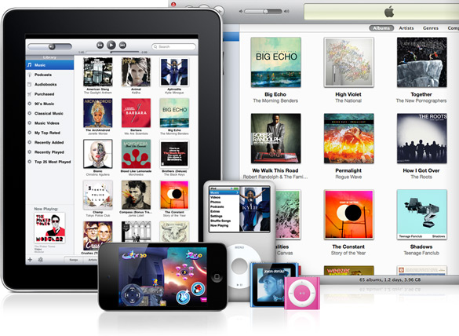
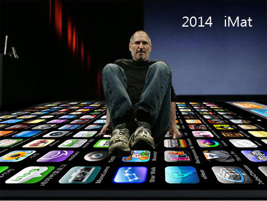

=============
“果粉”成长史
=============

.. TAGS: 苹果 认识 回忆

摘要
======

本文主要说明我个人对于苹果公司和苹果产品的一些认识的变化过程，以及
简单地预测了下苹果公司的未来。

正文
======

好久都听说苹果公司，听得比较多的是07年时，那时的 `iPod`_ 什么的还是比较火的，到
后来的 `iPhone`_ ，我那时的印象就是苹果公司就是一类似于我国的神舟或者oppo这种公司，
再到后来开始入手了一个 `iPod Touch`_ ，对于app store有了直观的认识，以及后面的Mac，
`iPad`_ 等纷纷入手，我开始成为了一个真正的“果粉”。

苹果的“小打小闹”
--------------------

那时是最初接触到苹果的一些公司和产品信息，也听过Jobs在斯坦福的讲演，感觉是苹果受困于
PC市场的竟争（鉴于微软的垄断性份额，事实上的苹果在这个领域堪称失败），以及软件硬件解决
方案的巨大竞争，所以才开始更加投入到移动终端领域。

那时的移动市场，还只是很初级，老大的诺基亚提供的只是满足大家通信这个基本的需要，通信以外的
它并没有着手关注。而那时，移动播放器也开始大兴其道，记得我的第一个mp3是newman的128M的播放器，
话说那时只有播放功能，还得一个7号的电池。

这时，nano,touch闯入了这个领域，对于我而言，只是认为它是"just another mp3 player"，并没有过多
关注其创新性的东西。即使后面知道苹果在这个领域有多么大的市场份额，也只是觉得这个领域本身意义
不大（相比于微软和intel等）。

那时也听说了iTunes的相关信息，知道这是一种营销模式，但是对于并不是首创的苹果也没带来多少印象上的
改观。

App Store
--------------------

`App Store`_ 的出现才让我如受猛然一击，眼前悄然出现了一个完整的软硬件完美结合的生态系统，参与其中的各个
环节都在有机，自愿地为整个生态系统增添着生机。

研究生时宿舍的哥们买了一个 `iPod Touch`_ ，于是我有机会尝试下这款印象并不是太好的产品。还记得第一次打开时，
手指放置其上进行一些触摸操作时，那种感受是许久没有过的。速度与体验的完美，各种有意思的应用等等，于是
我也开始想为自己购置第一款苹果产品。

当然，那时这位哥们已经开始尝试一些苹果应用的开发，从他口中听到的关于应用的赚钱传说也总是很吸引人的。

第一款产品 `iPod Touch`_ 入手，兴奋之余，切身体会到了 `App Store`_ 给这款硬件产品带来的增值，而如此的增值又反过来
促进了苹果产品的热卖，进而又促进了 `App Store`_ 中应用的销售，于是苹果，用户，开发者之间形成了一个供给完备的
生态系统，而在这个生态链上，苹果所扮演的基础设施作用（设备提供，应用开发环境，应用销售环境等）无处不在，
他所在的地方，虽然对于单个其它生态链上的角色的收费不高，但是基数和长尾的作用，让苹果坐收无尽的财富。

iPad横空出世
--------------------

去年 `iPad`_ 出来了，对于苹果不再偏见的我这时已经生出了崇拜出来，也就是开始粉苹果了。经过几个月的出货，去年时
苹果的市值竟然超过了微软（07年时这是我怎么也不会想到的），随着 `iPhone4`_ ， `iPad2`_ 等热销，整个由苹果创造出的生态系统
模式开始被各个厂家和公司所仿效。君不见，微软和亚马逊对于 `App Store`_ 不能专属于苹果的申诉，中移动等公司的应用商店，
平板电脑一夜之间的火暴，各种的苹果山寨产品， `iPad2`_ 在中关村的天价出售等。

这里有两件事值得一说。

第一件， `iPad2`_ 发布会时业界的关注度是其它公司难以企及的，记得第二天看视频时，看到Jobs的人时，内心竟是非常的感动，
我想对于其它产品我是怎么也生不出这种感情的。Jobs的宗教性质的产品理念看来是已经深入人心。

第二件，去年初，大致是电纸书最为风光的日子，newman，盛大，等等厂商分别介入，当然老大的汉王自是无比风光，
我那时也花了1000大洋买了个，甚至也向好友推荐，不过后来由于体验上的缘故还是用的不多。到了后来，自己入手了
iPad，再去看书时，内心的愉悦与书本身的愉悦相映成趣，电纸书已经好久没再用过了。于是，前几天听到了新闻说
汉王的几个高管减持股票及今年一季度的财务披露所显示的销售和收入的大幅下降，正如新闻中所言，平板电脑的冲击是
巨大的，而其中的开创者和领头者自是苹果的iPad.

后话
--------

随着其它厂家加入苹果所在领域的市场，如HP,Moto等，还有诺基亚与微软的联盟，Google Android操作系统的不断增加的市场份额，
本地化的应用商店的发展，及通信运营商在下游市场的影响，苹果的日子并不会是一直顺风顺水，当然这或许也是好事，
无论是对于用户还是产业而言。我想，只要苹果的创新精神不丢，苹果还会走得更远，我也有理由期待苹果的另一款
革命性的产品。

下载原文
===========
可从 `此处 <https://github.com/topman/blog/tree/master/2011/apr/my_apple_fans.rst>`_ 查看或者下载。 

参考资料
===========
1. `iPad`_ 
2. `App Store`_ 
3. `iPod`_ 
4. `iPod Touch`_ 
5. `iPhone`_ 
6. `iPad2`_ 
7. `iPhone4`_ 

.. _iPad: http://en.wikipedia.org/wiki/Ipad
.. _iPod Touch: http://en.wikipedia.org/wiki/Ipod_touch
.. _iPad2: http://en.wikipedia.org/wiki/Ipad
.. _iPhone: http://en.wikipedia.org/wiki/Iphone
.. _App Store: http://en.wikipedia.org/wiki/App_store
.. _iPod: http://en.wikipedia.org/wiki/Ipod
.. _iPhone4: http://en.wikipedia.org/wiki/Iphone
