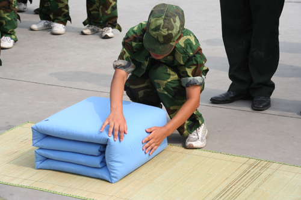

=================================
为什么一个人会缺少自律
=================================

原文链接: http://www.mifengtd.cn/articles/why-we-lack-of-self-discipline.html

今天在看google reader时读到这篇文章,一些话语正好触动了自己心里最脆弱的地方,
所以转在此处以鞭策自己,不时提醒自己,如何才能够更加自律,更加出色.

原文如下(去掉了部分链接):

::

    自律就是在该做的时候，不管喜不喜欢，都去做你应该做的亊情的一种能力。

    ——艾伯特·哈伯得

自律是时间管理的催化剂，它是支持时间管理持续执行的基石。塞缪尔·斯迈尔斯在他的《品格的力量》中说到：“自律是品格的精髓，美德的基础。”自律更是人们远离陋习，战胜自我的保障。在《圣经》中，赞誉并不是给予那些“攻城掠池”的骑士，而是给予那些“主宰自己灵魂”的人们。缺少自律的人将会一事无成。那么，在现实生活中我们为什么会缺少自律呢？

没有目标
============

生活、工作、事业必须有目标，人生必须有计划。在建立事业计划同时设立个人与组织的重要工作目标，为例行工作建立完成标准。在我们不能自己控制自己或要偷懒时，想想自己的目标和达到目标时所带来的一切。当每次一想到“成功的喜悦”就有使不完的劲。

没有计划与优先顺序
=====================

欠缺自律的第二种表现形式是忍不住要做一些与目标无关或关系不大的事情，做自己喜欢的事情而不是应该做的事情。在遇到这种情况时，耍安排优先顺序，将心力集中于最有成效的部分，这样可以保证所完成的工作一定是最重要的工作，而未完成的工作则是最不重要的事项。

拓展阅读： `《做真正重要的事》`_

没有设定完成期限
=====================

即使领导没有给我们设定完成期限，我们也要自己定一个期限。还可以把工作分成若干部分，每个部分都设定一个完成期限。强迫自己严格按照设定的日期完成工作，绝不更改完成期限。同时，在授权时，也要要求别人排定完成期限。这样可以带给人一种“紧迫感”，它可以强迫我们约束自己。

拓展阅读： `《如何利用期限来完成任务》`_

没有追踪进度
=====================

千万不要把计划当作一种形式，一定要实施它，监控工作进展程度。

没有运用随手可得的工具与技巧
===================================

运用褪墨介绍或使用你自己的工具和技巧：每日计划、每周计划、完成期限、待办事项清单、工作日记等。

对工作缺少兴致
=====================

漠不关心，对工作缺少兴致，是效率的大敌。重新检讨工作态度，认清漠不关心的态度更难形成自律。设立简单的目标，在达成目标以后奖励一下自己，促使自己对工作产生兴趣。

做事拖延
=====================

找出容易拖延的工作和决定，安排切合实际的完成期限，向别人宣布这些期限，请别人帮我们监视成果。当我们完成工作时，给自己一番奖励。

拓展阅读： `《防止拖延的积极步骤》`_

不良习惯
=====================

以好习惯取代坏习惯，尽量自主自发地采取有用的行动，使自己有多余的心思去做更有生产力的工作。要养成某个新习惯，就要尽量意志坚强加以练习，向别人宣称自己正在培养新习惯，以免自己故态复萌。在这习惯变得根深蒂固以前，绝不要让任何例外发生，抓住能表现自己决心的第一个机会。最后一定要记住：“形成新的工作习惯或者情感一般要用30天”。

拓展阅读： `《一个月培养一个好习惯》`_

富兰克林认为，自律体现了人类的勇气，是人类所有高尚品格的精髓。如果一个人完全由本能和激情来支配，那么他就会完全丧失道德上的行动能力和良心的自由，就会沦为欲望的奴隶。

所有的成功都来源于自律，要想尽快的养成自律，首先，要想象自己已经变成一个有纪律的人了，然后要像一个有纪律的人一样思考、行动，最后持之以恒。

推荐阅读： `《学会自律系列总结》`_

.. _《学会自律系列总结》: http://www.mifengtd.cn/articles/self-discipline-summary.html
.. _《一个月培养一个好习惯》: http://www.mifengtd.cn/articles/culture-a-habit-in-a-month.html
.. _《防止拖延的积极步骤》: http://www.mifengtd.cn/articles/steps_to_prevent_procrastination.html
.. _《如何利用期限来完成任务》: http://www.mifengtd.cn/articles/budget-your-time-how-to-use-deadlines.html
.. _《做真正重要的事》: http://www.mifengtd.cn/articles/how-to-focus-on-what-truly-matters.html
