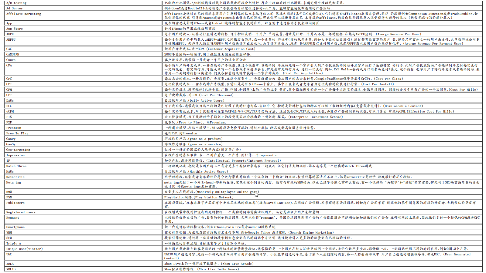

===================================
在线游戏领域的相关术语大全
===================================

术语是一个细分领域的语言,对于行外人而言,它就像英语之于母语的汉语,所以
进入一个领域了解相关的术语是重要的,也能够保证你知道关注什么,用什么来沟通,
因为通常术语就包含了这个领域中最重要的一些概念,思路和研究方法.

`社交游戏`_ 是我目前所处的领域,它是一个新生的行业,它有传统游戏所关注的ARPU等,
也有自身所关注的ARPPU等,所以让我不妨看看这个领域有哪些术语值得我们关注和理解.

下面的内容是翻译自 `GLOSSARY OF ONLINE GAMES`_ 这篇文章,英语好的不妨直接看原文.

另外所引文的网站也 `社交游戏`_ 领域非常值得关注的内容来源,十分推荐.

下面是内容:

同游戏行业一样, 广告行业也充满了容易混淆的术语. 因为游戏发行和游戏营销已经非常紧密地联系在一起,所以
非常容易产生术语的混淆.

下面的内容是我从 *如何发布游戏* 这本书中摘取出来. 一旦后续有新的被业界接收的术语术语,我也会将它增加到下面
的列表中. 如果下面的列表中没有你期望的术语,请来信告诉我.

=============================== ==============================================================
A/B testing                     也称为对比测试.A/B测试通过对线上网站或者游戏分别进行
                                再次小改动后的对比测试,来确定哪个改动更加有益.
------------------------------- --------------------------------------------------------------
Ad Server                       例如OpenX或者DoubleClick的动态广告报告与目标定位这样的web工具,
                                能够智能地发布连续的广告活动.
------------------------------- --------------------------------------------------------------
Affiliate marketing             Affiliates是通过自己的网站来将用户引导到你的站点来取得收入的
                                第三方网站(基于CPC或者CPA).它们通常由Affiliates联盟来管理,这样
                                的联盟例如Commission Junction或者TradeDoubler.如果你将你的玩家
                                引导到Amazon或者iTunes来出售自己的游戏,那么你可以注册并且自己
                                本身成为affiliate,通过向这些网站导入流量获得生额外的收入
                                (通常有5%-10%的额外收入)
------------------------------- --------------------------------------------------------------
App                             现在的意思是针对iPhone或者Android这样的智能手机的应用,
                                以区别于通过移动手机来访问网页.
------------------------------- --------------------------------------------------------------
App Store                       针对iPhone的苹果在线应用商店
------------------------------- --------------------------------------------------------------
ARPU                            每个用户的收入.从移动行业引进的指标,这个指标表明一个用户
                                平均花费,通常是针对一个月而不是一年的数据.应该与ARPPU区别.
                                (Averge Revenue Per User)
------------------------------- --------------------------------------------------------------
ARPPU                           每个支付用户的平均收入.ARPU和ARPPU之间很容易混淆.在一个免费的
                                游戏中(指的玩是免费,例如大多数的社交游戏),通过都有数百万的用户
                                数,但是只有百分之一的用户来支付.大多数游戏公司更多使用ARPPU,
                                而许多人通过将ARPU和用户数来计算出总收入.为了计算总收入,或者
                                将ARPPU乘以支付用户数,或者ARPPU乘以总用户数再乘以转化率.
                                (Averge Revenue Per Payment User)
------------------------------- --------------------------------------------------------------
CAC                             新用户开发成本,也叫CPA
                                (Customer Acquisition Cost)
------------------------------- --------------------------------------------------------------
CANSPAM                         2003年美国的一项法律,用于规范在美国发送商业邮件.
------------------------------- --------------------------------------------------------------
Churn                           客户流失率,通常指一月或者一年用户的流失百分比
------------------------------- --------------------------------------------------------------
CPA                             每个新用户的开发成本.一种在线的广告模型,在这个模型中,当媒体网
                                站成功地将一个客户引入到广告投放商的网站并且客户执行了某些特定
                                的行为,此时广告投放商向广告媒体网站支付每次支付一定的现金. 
                                特定的行为,可能是填写一个表格或者注册为会员,但是最常见的行为是
                                进行一次支付.例如,EVE Online会向成为订阅者而支付7美元.这个指标
                                也学用户于游戏开发者或者媒体网站,来作为一个关键的指标以衡量他
                                们从各种营销来源中获得一个客户的成本.
                                (Cost Per Acquisition)
------------------------------- --------------------------------------------------------------
CPC                             每次点击的成本.一种在线的广告模型,在这个模型中,广告投放商会为
                                每次用户的点击来付费.Google的AdSense程序是基于CPC的.
                                (Cost Per Click)
------------------------------- --------------------------------------------------------------
CPI                             每次安装的成本.一种在线的广告模型,当前只是局限在iPhone平台上,
                                其中开发者或者发布者为每次成功的安装进行付费.
                                (Cost Per Install)
------------------------------- --------------------------------------------------------------
CPM                             每千次的成本.所有媒体(包括电视,广播,印制,和网络)上的广告的主要
                                量度.这个指标衡量的是一个广告每千次浏览的成本.如果单指网络,
                                则指的是对于单条广告的一千次浏览.(Cost Per Mille)
------------------------------- --------------------------------------------------------------
CPT                             每千次的成本,同CPM.(Cost Per Thousand)
------------------------------- --------------------------------------------------------------
DAUs                            日活跃用户数.(Daily Active Users)
------------------------------- --------------------------------------------------------------
DLC                             可下载内容.通常我认为这个指的是已经被下载的任意内容.实际中,它
                                指的是针对打包好的物品可以被下载的额外内容(免费或者支付).
                                (Downloadable Content)
------------------------------- --------------------------------------------------------------
eCPM                            每千次的有效成本.用于比较针对标准的CPM活动和CPC/CPA活动的方法.
                                通过聚合CPC/CPA收入的总数,并除以广告被浏览的次数,可以计算出
                                有效的CPM.(Effective Cost Per Mille)
------------------------------- --------------------------------------------------------------
EIS                             企业投资模式,为了鼓励对于早期创业的投资英国政府推出的一项创新
                                模式. (Enterprise Investment Scheme)
------------------------------- --------------------------------------------------------------
F2P                             免费玩.(Free to Play). 同Freemium.
------------------------------- --------------------------------------------------------------
Freemium                        一种商业模型,在这个模型中,核心游戏是免费可玩的,通过对虚拟
                                物品或者高级服务进行收费.
------------------------------- --------------------------------------------------------------
Free To Play                    也叫F2P,同Freemium.
------------------------------- --------------------------------------------------------------
GaaPy                           游戏作为产品.(game as a product)
------------------------------- --------------------------------------------------------------
GaaSy                           游戏作为服务.(game as a service)
------------------------------- --------------------------------------------------------------
Geo-targeting                   仅对一个特定的国家的人展示内容(通常是广告)
------------------------------- --------------------------------------------------------------
Impression                      在线广告的基本单位.当一个用户看见一个广告,则计作一个impression
------------------------------- --------------------------------------------------------------
IP                              知识产权.或者网络协议.
                                (Intellectual Property/Internet Protocol)
------------------------------- --------------------------------------------------------------
Match Three                     一种游戏玩法,也就是当用户将三个或者更多个类似对象连在一起从而
                                让它们消失的玩法.钻石迷阵是一个经典的Match Three游戏.
------------------------------- --------------------------------------------------------------
MAUs                            月活跃用户数.(Monthly Active Users)
------------------------------- --------------------------------------------------------------
Metacritic                      用于对游戏,电影或者音乐的评价得分进行聚焦并给出一个混合的
                                "平均分"的网站.权重计算的算法并不公开,但是Metacritic是对于
                                游戏很好的反应指标.
------------------------------- --------------------------------------------------------------
Meta tag                        meta tag是位于一个网页<head>部分的标签,它包含这个网页的内容.
                                通常与有效的SEO相关,但是已经不再像之前那么有效.有一个很好的
                                "关键字"和"描述"非常重要,但是对于SEO而言高质量的页面设计比
                                修改meta tags更加重要.
------------------------------- --------------------------------------------------------------
MMO                             大型多人在线游戏.(Massively-multiplayer online game)
------------------------------- --------------------------------------------------------------
PSN                             PlayStation网络.(Play Station Network)
------------------------------- --------------------------------------------------------------
Publishers                      在游戏领域,"在未来数字产品发布中无立足之地的吸血鬼"(摘自David
                                Lau-Kee).在网络广告领域,发布商通常是指网站,例如与广告发布商
                                讲述他的基于浏览器的游戏的开发者,也通常认为是发布商.
------------------------------- --------------------------------------------------------------
Registered users                在线领域常常提到但没有用处的指标.一个成功的网站需要活跃用户,
                                而它是由独立用户来衡量的.
------------------------------- --------------------------------------------------------------
Remnant                         以较低的收费出售的广告,典型的例如通过网络.之所以称作"remnant",
                                是因为从网络购买广告的广告投放商并不能确切地知道他们的广告会
                                在哪些网站上展示,因此他们支付一个较低的CPM或者CPC费用.
------------------------------- --------------------------------------------------------------
Smartphone                      新一代先进移动扶持设备,例如iPhone,Palm Pre或者Android操作系统
------------------------------- --------------------------------------------------------------
SEM                             搜索引擎营销.为出现在搜索结果排名支付费用,例如Google,Yahoo
                                或者MSN. (Search Engine Marketing)
------------------------------- --------------------------------------------------------------
SEO                             搜索引擎优化.通过将一些关键的搜索词组包含到自己的网站中来达到
                                通过搜索引入更多的的流量到自己网站的过程.
------------------------------- --------------------------------------------------------------
Triple A                        一种高级的营销主题,目标通常不少于1百万个单位.
------------------------------- --------------------------------------------------------------
Unique user(visitor)            独立用户或者独立访客是网站的一种标准的流量衡量指标.通常指的是
                                一个用户在过去30天里访问一个网站,无论它访问多少次,都计做一次.
                                一些网站使用不同的时间区间,例如2周,3个月等.
------------------------------- --------------------------------------------------------------
UGC                             UGC即用户创造内容,是指一个游戏或者网站中由用户创造的内容.
                                小巨星中创造的等级,基于第二人生创建的内容,第一人称射击游戏中
                                用户自己创造的增强程序等,都是UGC.
                                (User Generated Content)
------------------------------- --------------------------------------------------------------
XBLA                            Xbox Live上的一项游戏下载服务.
                                (Xbox Live Arcade)
------------------------------- --------------------------------------------------------------
XBLIG                           Xbox独立制作游戏. (Xbox Live Indie Games)
=============================== ==============================================================

最后生成一个术语大全图供大家查看方便:

.. _社交游戏: http://towerjoo.blog.techweb.com.cn/social-game
.. _GLOSSARY OF ONLINE GAMES: http://www.gamesbrief.com/2010/07/glossary-of-online-games/
