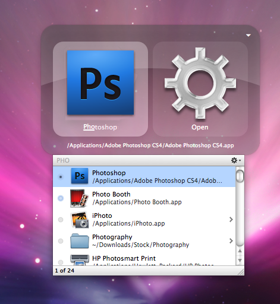
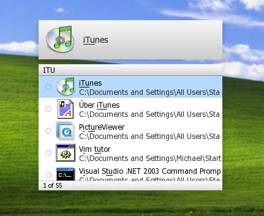
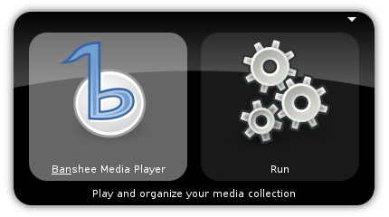

=============================
使用快速启动来提高生产力
=============================

不知道你是否已经厌烦了点击开始菜单,找到合适的应用,点击应用这个繁琐的流程,
是否想着一个命令或者一个操作就打开自己想要的应用,本文就是说明在主流的操作系统(Win,Mac,Linux)下
最常用的快速启动应用.或许你每天都在用它们,或许你是第一次听说,无论如何不妨可以
来尝试下,那种快速直达的快感.

文中不讨论过多的复杂应用,只是想实现一个简单的目标,即快速地打开自己想要打开的应用.让我们开始
这次提高自己生产力之旅吧.

Mac
=====

首先说到的是苹果的Mac,是因为Mac下的 `Quicksilver`_ 可谓是这几个类似应用下最成熟和最让人欣喜的应用.

有了它后,你的流程则是,调出 `Quicksilver`_ ,输入目标应用名字中所含的字符, `Quicksilver`_ 会自动匹配,
当找到自己的目标应用后,点击回车即可.

这个过程便完全使用键盘完成了,至于键盘之于鼠标的高效性,不妨可参考Xuyou的系列文章 `完全用命令行工作-1\: 拔掉你的鼠标`_.

来自 `发布者 <http://quicksilver.en.softonic.com/mac>`_ 的描述:

    For those of you not familiar with Quicksilver, it's an application that lets you reach any program,
    folder or file in a few keystrokes. You don't have to go searching through your files, 
    you don't have to worry about how your folders are arranged. For many, Quicksilver was a godsend in the pre-Spotlight Mac era. 
    Although it's lost some of its importance with the new powerful search and 
    Finder features in Leopard it still remains very much an excellent Mac application.

Win
=====
我们再来看Win, Win下我试了不少的类似软件,最后还是比较喜欢的是 `Colibri`_, 它没有 `Quicksilver`_ 那么强大,
但是在快速启动应用上得心应手.

来自 `Colibri`_ 官网的描述:

    Type Ahead — Information at the Tips of Your Wings

Linux
========
让我们再回到程序员比较喜欢(我个人相比Mac我更喜欢Linux)的Linux, 与 `Quicksilver`_ 功能比较接近的 `Gnome Do`_ ,完全能够快速地完成目标.
 

来自 `Gnome Do`_ 官网的描述:

    Simple, sleek, swift, smart. Do.
    GNOME Do allows you to quickly search for many items present on your desktop or the web, and perform useful actions on those items.
    GNOME Do is inspired by Quicksilver & GNOME Launch Box.

题后话: 因为主要的工作环境是Linux, 其次是Win,Mac则用得很少,当然对于操作系统我并没有什么偏见,因为目标才是最重要的,
哪个平台最适合干什么,我便会去用哪个平台,仅此而已. 在Linux下,我设置的快捷键是Alt+D,当然Win下的 `Colibri`_ 也用了相同的命令,话说
甩掉鼠标,生产力着实提高不少. 如果您是程序员,不妨今天就开始使用吧.

.. _Quicksilver: http://en.wikipedia.org/wiki/Quicksilver_(software)
.. _Colibri: http://colibri.leetspeak.org/
.. _Gnome Do: http://do.davebsd.com/
.. _完全用命令行工作-1\: 拔掉你的鼠标: http://blog.youxu.info/2008/09/04/unplug-your-mouse/
