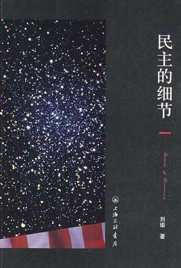

=====================
30天“挑战”之2011年5月
=====================

.. TAGS: 30天挑战 2011

摘要
======

确定了本月的“挑战”，即无飞机（参考文中）和 `民主的细节`_ 阅读，并说明了为什么
确定这两个“挑战”。

正文
======

`上个月开始了30天“挑战”系列`_ ，当然一直会坚持着，正值五一小长假的今天，我便将这个月的计划列出来。
想了想将什么作为这月的“挑战”比较合适呢？阅读，跑步还是别的？

老婆今天上午去她的妹妹那儿，我一人在家，于是看起了微博，看到了 `@不加V`_ 老师发起的一个讨论，并且
浏览了几乎所有的留言，微博的地址在 `这里`_ ，不知道是否会被和谐。这大致是一个关于性的一个讨论，从留言
来看，不乏一些吹牛的兄弟和姐妹，还有求ONS的同学；只是围观的我，其实也在思考这个问题，“性是不是和自由
一样不容扭曲的限制”。

晚上老婆回来时，让老婆也看了看，单纯的老婆说很多地方看不懂，我笑说这是少儿不宜。

而此刻老婆已经休息了，安静极了，老婆没有过多的欲望，于生活，于物质，于性。而我呢？一直对这个话题比较
隐晦的我，其实也不曾间断思考过这个问题。其实从高中时开始了解，从第一次的尝试到今天的有了老婆，这过程
中我一直是在努力面对这个问题。

`@不加V`_ 的微博就像酒一样，此刻我借着酒劲，也开始真正公开面对下这个平日里羞于启齿的问题。对，是个问题，
特别是对于男生；别的的男生，我不知道，自己是看见性感或者自己喜欢类型的女生时总有将其摁到的冲动的，也是
在看A片时总幻想自己就是那男主角的，不定时地还会玩下飞机。

有一种时候，是抓狂的。看见性感的美女后，或者自己突然生出性的念头时，自己便坐立不安，任何其它的事物都无法
平复那时心中的狂躁，平常看的周星驰、天下足球、科比灌篮这时根本没有一点心思，微博、平常非常喜欢的书籍，此时
变得没有一丁点吸引力。我不知道这是种什么样的力量，或许是荷尔蒙泛滥后的症状，如同万千蚂蚁在心中乱爬乱咬，而
中止这一切的开关就在两腿之间的龙头上。

记得，自己经常也会困扰与飞机事宜，不过一次看到过 `@连岳`_ 回答一个青年类似的问题时，有如下的精彩回答：

::

    1、看见漂亮女孩子很冲动，很正常。看见丑女孩才冲动，那叫反常。
    2、看黄色电影后手淫也很正常，看了没反应才反常。
    3、手淫怕被同学看见也很正常，找个安全一点的地方吧。
    4、24岁性欲“蓬勃”很正常，性欲不振才反常。
    5、手淫不是罪，不会对不起父母，性欲长期释放不了才可能做对不起父母的事情。
    6、那些关心你的人，尤其是男性，基本上都手淫过，不要觉得对不起他们。除非你手淫时想着他们。
    7、就算想着他们，似乎也不必对不起他们，给他们面子呢。
    8、性其实是你生活的细小组成部分，几天才想一次，有时几周才手淫一次——你真忍得住。
    9、你比你想象的纯洁。
    10、我们的教育比我想象的还要失败。
        
这些话语确实减轻了一些负疚，但是自己也在思索这个问题。还是记得有一个名人说过，“当你知道没有任何监督和惩罚时，
你会选择怎么做，这才能体现你的道德”，我十分认可这种发自本能或者自我道德约束下行为选择；而“自制力是一个人成熟
和成功的体现”，与自己战斗是痛苦的，也是辛苦的，但是往往也是最易带来成就感的。“与天斗，其乐无穷；与人斗，其乐无穷”，
我要加一句“与己斗，其乐无穷”。

所以，即使某些行为有足够的理由得以认定为合理或者可以理解，但是，当自己觉得不喜欢或者觉得不自在时，让自己逐渐摆脱
这种束缚的过程，通常就是与己斗的过程。

说了半天，其实就是想说明，本月的一个“挑战”就是本月无飞机。

根据 `迟到的2011年度计划`_ ，年度的阅读计划还是不轻的，基本上需要一月有2本书的阅读量，为此本月的另一个“挑战”与上月一致，
也是阅读，紧接着 `林达的民主`_ 的话题，本月的计划是刘瑜的 `民主的细节`_ 。

至此，本月的“挑战”计划已经确定，具体如下：

1. 本月无飞机
2. 刘瑜的 `民主的细节`_ 

相应的，月底会有一个回顾来总结本月的执行情况。

总结
=========

第一次写这种羞于启齿的内容，或许还是自己有些虚伪，或许还是不成熟，不过这个博客本就是记录自己成长过程中的点滴，我想
能够面对这本身也是种成长。

下载原文
===========
可从 `此处 <https://github.com/topman/blog/tree/master/2011/may/30_days_challenge_may.rst>`_ 查看或者下载。 

参考资料
===========

1. `迟到的2011年度计划`_ 
2. `@连岳`_ 
3. `上个月开始了30天“挑战”系列`_ 
4. `@不加V`_ 
5. `林达的民主`_ 
6. `民主的细节`_ 

.. _上个月开始了30天“挑战”系列: http://towerjoo.blog.techweb.com.cn/archives/150.html
.. _@不加V: http://weibo.com/1496913734
.. _林达的民主: http://towerjoo.blog.techweb.com.cn/archives/175.html
.. _迟到的2011年度计划: http://towerjoo.blog.techweb.com.cn/archives/188.html
.. _民主的细节: http://book.douban.com/subject/3813669/
.. _这里: http://weibo.com/1496913734/ezu8kogexgg
.. _@连岳: http://weibo.com/lianyue
