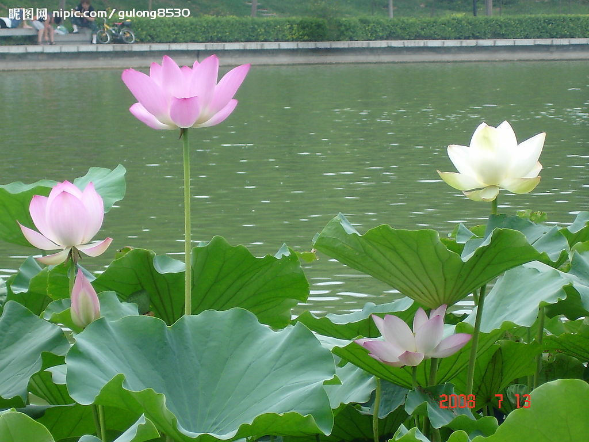
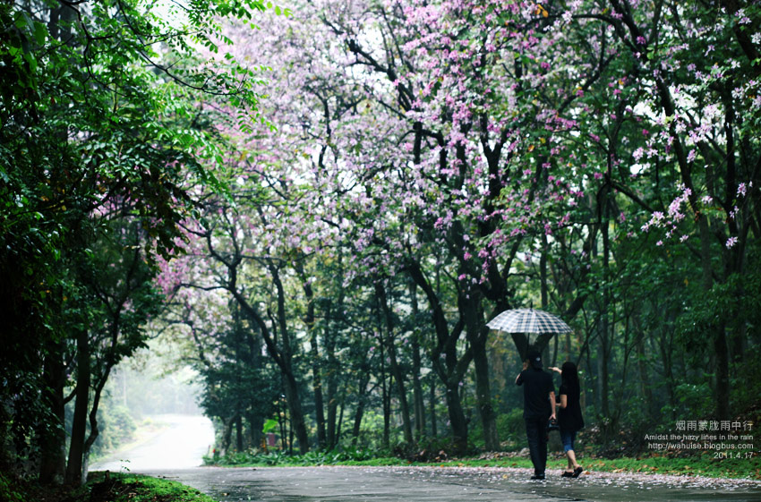
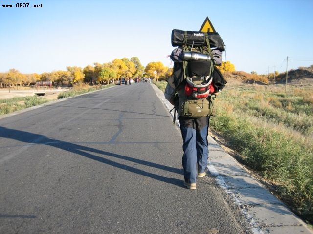

============
完美生活
============

.. TAGS:生活 反思

摘要
======

本文主要通过三个场景（荷塘小屋，雨中漫步，陌生的行囊）写了自己所向往的完美生活。

正文
======

总共三个场景。

荷塘小屋
-------------

细雨，下午，迎着荷塘的小木屋。我撑开木窗，能听见雨声，能看到雨溅荷叶的爽快。
这是深夏，雨带走了热气，周围只有雨声，还有偶尔的几声蛙叫。

我坐在木窗前，摊开一本书，大致会是如水墨画的怡情散文，恰适合这午后的时间。桌上还有
一个陶壶，和一个小茶杯，印有朴素的花纹。

老婆，在一旁，我们不言语，只享用这无边的惬意。

雨中漫步
-------------

深夏，天上下着不大的雨，路有些泥泞，路面上积有浅浅的水坑。

老婆和我，没有撑伞，慢慢地走在这泥泞中。

路边是两排树，很高，很大，远处有水雾在漫着，世界显得有些不逼真。

我们不说话，只是静静地走着，不刻意避免那些小水坑；我抬头望着这无来由的雨，感受大自然
无比的力量。

静，只听得见轻轻的脚步声，和雨声。

陌生的行囊
-------------

老婆，我，背起行囊，开始或走或停于陌生的地方。

我们不带地图，我们装扮很穷，我们迷路会问路人，体会语言障碍下的交流。

入乡随俗，住在山里，住在草原上。

自然，是生命的延续，因为它总在那里看着我们，它区分不了路人甲和比尔盖茨。

人，是自然的延续，即使不认识，相似的笑容在表达着自然所不能表达的情感。

不带相机，不买纪念品，不留下来过的痕迹，不带走来过的证据。

如此三年，走过若干城市，那便是完美。

总结
=========

不知道为什么，自己非常喜欢下雨，喜欢听雨声，可能是小时候，经常会听见自己家里房子漏水母亲用盆接着时，
那响亮而悦耳的声音吧。

喜欢大自然，喜欢一种意境，能让内心真正的平静起来，哪怕那一刻的平静也显得那样美丽。

完美生活，有些有幸曾体验过，有些便是余生的一个追求，留个念想，也说是好的。

下载原文
===========
可从 `此处 <https://github.com/topman/blog/tree/master/2011/may/perfect_life.rst>`_ 查看或者下载。 

