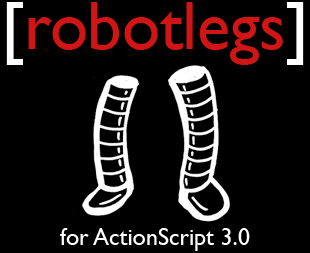

===================================
Robotlegs Hello World详细教程
===================================

.. TAGS:Robotlegs 教程 flash

摘要
======

本文详细说明了使用 `flashdevelop`_ 基于 `Robotlegs`_ flash框架完成一个Hello World示例的
教程，这个示例包括完整的MVC（及Service）。

正文
======

开始之前
-----------

本文已经假定你具备下面的知识：

1. 阅读过类似于 `Essential Actionscript 3.0`_ 这样的书籍，对于Actionscript语言和flash基本显示体系、事件等有一定了解
2. 能够较熟练地使用 `flashdevelop`_ flash IDE
3. 阅读过 `Robotlegs`_ 的文档 `Robotlegs Best Practice`_ 

下载相关的库
------------

1. 下载 `Robotlegs`_ 相关的swc库，可以从 http://downloads.robotlegs.org/robotlegs-framework-v1.4.0.zip 下载
2. 解压后，在bin目录下有个 *robotlegs-framework-v1.4.0.swc* 以及libs目录下有个 *SwiftSuspenders-v1.5.1.swc*
3. 上面两个swc就是我们需要的

建立项目
------------

1. 打开 *flashdevelop*
2. 建立一个名为 *RobotLegsHelloWorld* 的AS3 Project
3. 将上一步中的两个swc拷贝到新建成项目中lib目录下（IDE左侧的文件结构列表中）
4. 在拷贝好的文件上点击右键，选择Add To Library，将两个swc都加入到library中

这时基本的结构就好了，我们开始写代码。

定义需求
------------
这个例子是个完整的说明 `Robotlegs`_ 框架的例子，所以会涉及到框架的各个主要部分，包括Model, View, Controller，为此
我们定义了这个例子所要完成的需求如下：

用户登录系统的过程，包括：用户输入名字和密码，提交表单，后端进行验证(简化起见，不作真正的验证），并返回成功与否的结果。

整个结构
----------

根据上面的需求定义，我们可以有下面的系统架构：

.. image:: ../../images/robotlegs_helloworld.png

具体的各个角色（actor）的功能，参考代码中的注释。

需要说明的是：

1. 在理解代码和框架时，最好知道如单例模式
2. 对于 `依赖注入`_ 有一定理解
3. 对于 `MVC`_ 有一定理解

其它应该还是比较容易理解的。

总结
=========

从最开始使用 `pureMVC`_ 到这个项目使用 `Robotlegs`_ ，两个框架都挺好的，在整个项目的进展中，更加觉得要控制住代码质量并不
取决于框架本身，而是取决于使用框架的人，各位程序员们要加油了。

另外，也可以参考我的另一篇博客 `RobotLegs简介`_ .

下载原文
===========
可从 `此处 <https://github.com/topman/blog/tree/master/2011/may/robotlegs_helloworld.rst>`_ 查看或者下载。 

下载源代码
=============
可从 `这里 <https://github.com/topman/blog_code/tree/master/RobotLegsHelloWorld>`_ 查看或者下载。 

参考资料
===========
1. `flashdevelop`_ 
2. `pureMVC`_ 
3. `MVC`_ 
4. `Essential Actionscript 3.0`_ 
5. `依赖注入`_ 
6. `Robotlegs Best Practice`_ 
7. `Robotlegs`_ 
8. `Robotlegs简介`_ 

.. _pureMVC: http://puremvc.org/
.. _MVC: http://en.wikipedia.org/wiki/Model%E2%80%93view%E2%80%93controller
.. _Essential Actionscript 3.0: http://book.douban.com/subject/2140652/
.. _Robotlegs: http://www.robotlegs.org/
.. _依赖注入: http://www.cnblogs.com/xingyukun/archive/2007/10/20/931331.html
.. _flashdevelop: http://www.flashdevelop.org/wikidocs/index.php?title=Main_Page
.. _Robotlegs简介: http://towerjoo.blog.techweb.com.cn/archives/210.html
.. _Robotlegs Best Practice: https://github.com/robotlegs/robotlegs-framework/wiki/Best-Practices
