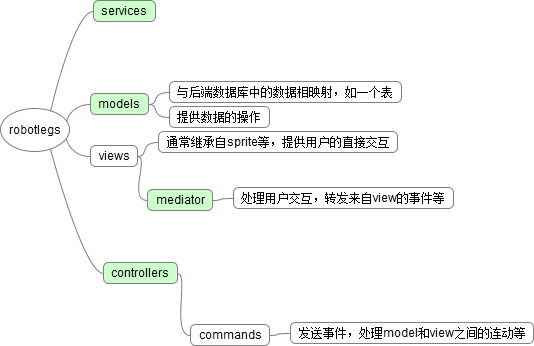
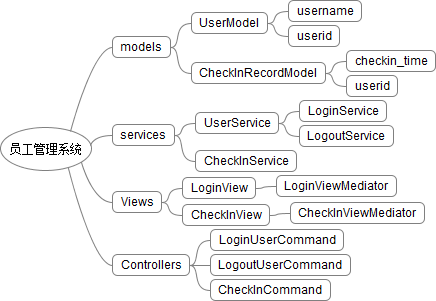

===============
RobotLegs简介
===============

.. TAGS:

摘要
======

本文简单地对 `pureMVC`_ 和 `robotlegs`_ 进行了对比，并且较详细地说明了 `robotlegs`_ 
各个角色的职责, 以及使用 `robotlegs`_ 的常见的注意事项。

正文
======

最近开始前端的开发，即flash开发，之前使用的是 `pureMVC`_ ，也写过一篇关于
`pureMVC notification`_ 的博客；而这个项目的开发是使用 `robotlegs`_ ，
所以，这篇博客主要是基于过去这几周的工作和自己的理解对这个框架的一些简单
说明，希望对看到的朋友有益。

整体感受
-----------

做前端的开发不多，与后端相比一些UI上的处理、事件的处理等差异比较大，但是
编程的思想（如解耦、接口编程而非实现编程等）还是一致的，与后端比没有多大
可比性，所以我想简单地说明我对于 `pureMVC`_ 和 `robotlegs`_ 二者的一些
感受。

`pureMVC`_ 是基于 *notification* 的一个MVC框架，主要目的是为了各个部分
能够解耦，当然它也基本上能够做到。 `robotlegs`_ 则是基于 *message* 以及
*message* 携带的payload(数据等)来实现解耦。 `robotlegs`_ 是基于 `pureMVC`_ 的
思想，但是在一些方面更加出色，例如消息的强类型，依赖注入方式，消息携带payload
等等。

当然，任何一个好的东西（语言、框架等）最终还取决于用的人，语言和框架本身并不能
保证用户的代码清晰、解耦等，当然它只是尽可能地做到这点。

关于robotlegs
------------------

还是一个MVC的框架，它的几个角色的主要功能有：

1. M(odel): 提供数据的存储（与后端数据库表的映射），操作等
2. V(iew): 呈现给用户，提供对用户操作的响应等

    * 通常一个V对应于一个Mediator
    * Mediator的职责是转发来自V的事件到整个框架，或者接收来自框架的事件并更新V（通常通过调用V的方法）

3. C(ontroller): 业务逻辑，处理M和V之间的连动

    * 通常对应于一个Command
    * Command的职责有，实现业务逻辑，发送事件等

除此之外， `robotlegs`_ 还有一个角色是 *service* , 主要职责是提供一些获得数据的服务接口，
它本身并不存储（和model的区别）数据和提供数据的操作。

为了更好的说明起见，我想以一个员工考勤系统为例来说明各个角色的职责。

为了简化起见这个员工考勤系统只有如下功能：

1. 提供一个界面供员工登录
2. 提供一个界面供员工点击来作为考勤的时间

后端也可以很简单，例如有用户表User(id, name), 用户考勤表CheckInRecord(user_id, checkin_time),
那么前端使用robotlegs的结构可以采用：

使用robotlegs的注意事项 
------------------------

1. 注意各个角色初始化的顺序（顺序关系到注入及事件处理的逻辑）
2. 注意注入的使用（提前初始化）
3. 其它的可参考 `Best Practice`_ 

总结
=========

还是一句话，框架或者语言只能在最大限度上保证用户代码的清晰、可读、解耦、可维护等（例如python语言），但是
最终的代码质量还是取决于用户本身（程序员），所以一些编程的哲学和模式才是更为关键的（大致可看下
`Code Complete`_ 、 `Desgin Patterns`_ 等）。

最近一直在看 `Code Complete`_ ，一句话让我感受非常深，大致意思是说 **写代码的过程就是复杂度管理的过程(Complexity Management)** ，
这一点之前的认识不够，我推荐给看到的朋友，将它和 *DRY* 原则一样牢记在心吧。

下载原文
===========
可从 `此处 <https://github.com/topman/blog/tree/master/2011/may/robotlegs_intro.rst>`_ 查看或者下载。 

参考资料
===========
1. `Best Practice`_ 
2. `pureMVC`_ 
3. `pureMVC notification`_ 
4. `robotlegs`_ 

.. _Best Practice: http://github.com/robotlegs/robotlegs-framework/wiki/Best-Practices
.. _pureMVC: http://puremvc.org/
.. _pureMVC notification: http://baidu.com
.. _robotlegs: http://www.robotlegs.org/
