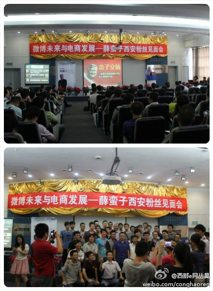

========================
关于西安的创业环境
========================

.. TAGS:创业 总结 西安

摘要
======

昨天参加了 `@薛老`_ 的西安见面会，感受到了西安的创业者和IT相关的从业者，也生出了对于
西安创业环境的一些感想，记录如下。

正文
======

昨天参加了 `@薛老`_ 的见面会，对于会上所分享的内容，从中学到了一些东西，例如腾讯微博和新浪微博的
群体差异可能会让游戏从业者在腾讯微博的应用上更有机会，新浪微群的“失败”能否让我们看到有一种可能来
开发一个应用解决这个问题，西安的新浪微博注册用户中国前五的论断让我们西安的互联网从业者更加有信心（关于
前五的论断我是存疑的，北上广自不会超过，杭州、成都、武汉、南京等城市我觉得也很难超过，当然这个消息也
只是会上新浪人员的一句简单带过的说法，可信程度有多大很难说了。）

当然这些技术层面的所得是一方面，我觉得更大的收获是对于整个西安创业者和互联网从业者的一种直观感受，
我感受到的是不输于北京的一种开拓精神，当然对于领域的深入程度还有些差距。

会场上和几个与会的朋友微博交流，到今天在微博上认识更多的朋友，计划 `中秋后的周末碰面交流`_ ，这些都让我
觉得很高兴，之前大家的印象中的西安的创业环境和沟通氛围差我想更多原因是没有找到组织和渠道吧。

如何找到组织
----------------

我个人不倾向于超过10人的聚会，因为我想听到与会的每个人的声音，一种声音就是一种思路，一种思路就可能让我们顿悟或
者解决我们萦绕许久的疑问；而且我也想与与会的每个人成为朋友，不只是是网络，而且是现实的，能够与投机的朋友闲时打打电话
问候、喝茶等。

我这里提供几个可以加入的"组织"，一个是 `西安创业者沙龙微群`_ ，另一个是我建立的 **西安创业者沙龙QQ群** (群号是: 173393167)，
我们希望加入的同学都是符合“创业者”这个特质的，或者有志成为创业者的人，您在申请中不妨说明您当前的情况让我们更加快速地
通过你的请求。

我的评价
----------

那么从北京已经回来3个月的今天，对于西安的创业氛围的评价是否有改变呢？如果用一句话来评价， **基本不比预期的差，还能稍好一些。**

对于一个城市的创业环境的评价，我通常有几个方面的考量：

1. 沙龙性质的活动是否有较多的数量和质量，是否沙龙有固定的组织人员和定期的活动安排，及会后的总结和分享
2. 沙龙与会人员的数量和质量
3. 是否有当地领域内的知名企业对交流的贡献（场地，公司和项目的分享等）
4. 创业者之间的合作
5. 招聘合适人员的难度
6. 同业之间是否有交流的机会和合作的可能

改善创业环境
---------------

作为技术人员出身的我，从技术上考虑的思路也是我最直接的想法，有一个专门的博客来完成活动的通知、总结等是比较合适的，再结合到
新浪微博作为大家主要的交流平台，那么对应的新浪轻博客也是比较合适的思路。

接下来我会联系上述微群的创建者来讨论方案的可行性，和确定是否采用。一旦确定也会更新到这篇博文中。

总结
=========

昨天看到的一篇微博上说的2-8理论的新解，我引用在此作结：

::

    【二八定律：你要做20%，还是80%？】 
    ①20%的人用脖子以上来挣钱，80%的人用脖子以下赚钱。 
    ②20%的人买时间，80%的人卖时间。
    ③20%的人做事业，80%的人做事情。
    ④20%的人计划未来，80%的人早上才想今天干什么。
    ⑤20%的人改变自己，80%的人改变别人。
    ⑥20%的人是富人，80%的人是穷人。

原文见:  `这里`_ 

下载原文
===========
可从 `此处 <https://github.com/topman/blog/tree/master/2011/sep/xian_startup_enviroment.rst>`_ 查看或者下载。 

参考资料
===========
1. `中秋后的周末碰面交流`_ 
2. `这里`_ 
3. `@薛老`_ 
4. `西安创业者沙龙微群`_ 

.. _中秋后的周末碰面交流: http://weibo.com/1748916305/xmvBC07DB
.. _西安创业者沙龙微群: http://q.weibo.com/875737
.. _这里: http://weibo.com/1649252577/xmw6qrirw
.. _@薛老: http://weibo.com/n/%E8%96%9B%E8%9B%AE%E5%AD%90
