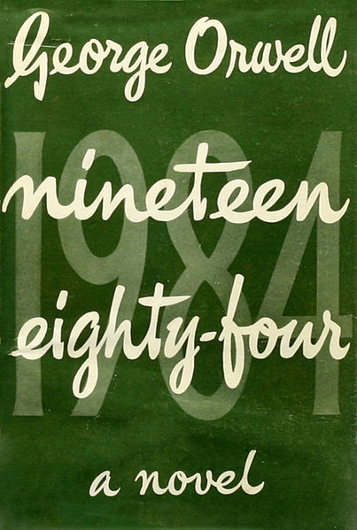

========
Room 101
========

.. TAGS: 1984 阅读笔记

正文
======

今天终于读完了略显沉重的 `《1984》`_ ，这是一本好书，她影响了人类的一些政治
决策和进程，特别是对于西方的文明。当政府要出台一个关于公民隐私的政策时，
人们便想到了1984，想到了无处不在的“电幕”，想到了恐怖的101房间，于是
人们对于可能侵犯隐私的政策都是慎之又慎，无论政客或者人民。

Smith是个很普通的人，如你我，我们认为某些统治无法摧毁我们时，那是因为
我们没有进入我们的101房间，当我们进入101房间也会立时土崩瓦解，所有的信仰
荡然无存。所以，人们都是脆弱的，我们无法凌驾在痛苦之上，我们也无法为了信仰
而承受最严厉的痛苦和折磨，于是1949（1984出版的年份）后，政治家和民众更多的
是在预防可能出现的老大哥和那样的社会，我想，这是正确的途径。

另外，对于历史的局限性作者表述的特别到位，存乎于人们意识中的所谓历史，我们
没有目见耳闻亲历历史，而只是在看当政者编著的历史，有多少偏颇，离真相有多远，
我们无法加以甄别，我是相信作者对于当政者对于历史的处理方式的，略带夸张但不乏
真实。所以，当政者写自己的历史往往是不可取的，想到了我国的 `《二十四史》`_ ，往往
是后一朝代编写前一朝代的历史，虽即如此，梁启超还是评价道：“二十四史非史也，
二十四姓家谱而已”，可见如此尚存偏颇，倘若当代人写当代史那更是相差甚远了。

我想在中国，目前存疑还是比较欠缺的，事无巨细，我们都以存疑为剑，这样不至于盲从任何
流言，这样谣言也会愈发少些，愤青也会更加少些，民智开启的日子更会近些，民主也会
更加近些。

总结
=========

无论如何，这是本值得一读的书籍，所谓的警示恒言是也。

下载原文
===========
可从 `此处 <https://github.com/topman/blog/tree/master/2012/feb/room_101.rst>`_ 查看或者下载。 

参考资料
===========

1. `《1984》`_ 
2. `《二十四史》`_ 

.. _《1984》: http://book.douban.com/subject/5299764/
.. _《二十四史》: http://baike.baidu.com/view/16492.htm
