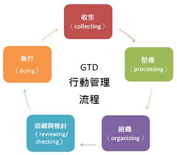

========================
30日挑战之2012年1月
========================

.. TAGS:

摘要
======
去年开始的 `30日挑战系列`_ ,到后来因为种种原因没能坚持下去，现在比较规律的生活后，
再加上新年的开始，重新开始也显得顺理成章。

2012年1月的挑战
=====================

今天已经是11号了，再加上春节假期，剩余的可使用时间不多了，所以本月的挑战相对容易些，包括：

1. 阅读完 `引爆点`_ ，并完成相应的读后心得
2. 基于简化的 `GTD`_ 理念和 `Doit.im`_ 工具来进行每日的工作管理（具体见下面的具体操作方法）
3. 对于每天的消费进行记录，主要使用 `随手记`_ 的web版和android版
4. 完成记忆有道词典中自己添加的生词(生词截止时间为2012.01.11，月末考核的正确率不低于90%）

基于GTD的工作管理
=====================

每天晚上首先对前一天的计划的执行情况进行总结分析，得出可改进的经验（类似于scrum一个sprint完成后的
例会），分析工作量是否合适、完成情况及原因。

然后，对第二天的工作进行计划，注意“可度量”的原则，忌出现模糊的表述。

所有的信息，在家里和手机同步，在一天的工作中出现的想法可放入inbox中成为晚上计划的候选，晚上回来
使用wifi同步。

使用随手记记录消费
====================

操作过程的主旨是：在家使用wifi同步各客户端，消费过程中尽快记录。

总结
=========

有计划了，余下的就是坚持，开始吧。

下载原文
===========
可从 `此处 <https://github.com/topman/blog/tree/master/2012/jan/30_days_plan.rst>`_ 查看或者下载。 

参考资料
===========

1. `随手记`_ 
2. `30日挑战系列`_ 
3. `GTD`_ 
4. `引爆点`_ 
5. `Doit.im`_ 

.. _随手记: http://www.feidee.com/money/
.. _30日挑战系列: http://towerjoo.blog.techweb.com.cn/archives/150.html
.. _GTD: http://en.wikipedia.org/wiki/Getting_Things_Done
.. _引爆点: http://book.douban.com/subject/3900987/
.. _Doit.im: http://doit.im
