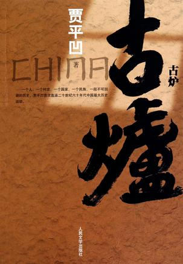

====================
关于《古炉》
====================

.. TAGS:读后感 贾平凹

正文
======

不到一个月的时间看完了 `贾平凹`_ 的 `《古炉》`_ ，这是一个67W字的长篇小说，叙述的是
一个陕西的小村庄在文革期间发生的事情，关注的是农村的风土人情、人情世故、
情感变迁，以及外界变迁对于这个村庄的影响。

之前看过了贾平凹的部分作品，如获得茅盾文学奖的 `《秦腔》`_ 、散文选和一些短篇
小说，不谈文学性或者别的所谓专家评论家的主要谈论对象，我只想说些自己的感受。

首先，阅读体验。贾的小说，特别是农村题材的小说读起来总是让人愉悦的，虽即
充斥着大量的陕西方言，但通常是加分项，让这类型的小说更显兴趣盎然。贾是讲故事
的高手，阅读中听着作者娓娓道来，读者总能很快进入故事中，为主人公担心起来，
所以即使文字量很大，也总是让人读起来非常受用和享受的。

其次，文字。要我去评价一个文字的好坏，我是很难说的，但是像曹雪芹的、鲁迅的，
我是能觉出其中的优秀的，但是到了近代作家的文字，我是很难说的。别的评论家
大致认为贾的文字是优秀的，所谓“鬼才”。我的感受是，简单、朴素、实在的文字，
给我“大巧若拙”的感觉，特别是乡土浓郁是用方言书写时，更显得别致。有时候
在想，倘若此类文章不用方言书写还能用别的什么呢？

最后，寓意。文字总是要说些什么的，大到为历史立碑，小到个人情绪的记录，贾的文字
也是试图说明一些事情。 `《古炉》`_ 作者说过自己的宏大初衷，细细读过，也基本能够体味
到作者的那份心意。人有三六九等、各色不同，在面对宏大历史背景变迁时的应对方式，
鸡毛蒜皮的计较，落井下石的卑劣等。每个人都在努力活着，或许没有远大的目标，只是
为某一个念头，为某一个人在苟延残喘的活着，即使如此，每个人的活着的动力是那么
强劲！就像狗尿苔只是为了摆脱四类分子的帽子、杏开为了霸槽浅薄如纸的情。

读完了，厚重的文字也从纸上漫进了读者的心里，而每个读者都有自己的一面筛子，留在
心里的是什么，那自是也不尽相同的。

下载原文
===========
可从 `此处 <https://github.com/topman/blog/tree/master/2012/jan/about_gulu.rst>`_ 查看或者下载。 

参考资料
===========

1. `贾平凹`_ 
2. `《秦腔》`_ 
3. `《古炉》`_ 

.. _贾平凹: http://baike.baidu.com/view/2037.htm
.. _《秦腔》: http://book.douban.com/subject/1281653/
.. _《古炉》: http://book.douban.com/subject/5910655/
