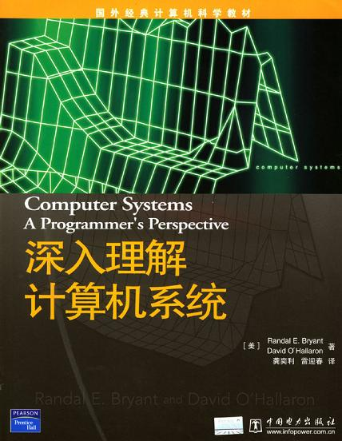

===================
30日挑战之2012年3月
===================

.. TAGS:20日挑战

摘要
======

阳春三月了，天气也不再那么的冷，两会也在北京顺利地召开着，小区的草儿也开始
泛绿了，话说真正的春天是要来了。莫道春来早，计划也总于这个美丽的季节联系在一起，
同样，我的 `30日挑战`_ 也继续着。

2012年2月的挑战完成情况
=========================

1. 已经阅读完了 `引爆点`_ 和 `1984`_ ，并且也写了相关的简评，分别见 `这里(引爆点)`_ 和 `这里(1984)`_ .
2. 基于GTD的Doit.im使用上本月做的不够好，很多时候甚至都没有进行很好的plan和check
3. 记录消费也做的不好，基本上暂停了记录
4. 单词的记忆也是完成的不好
5. 运动只完成了一次，后续便取消了

总体来说，整个月的计划完成的不好，5条只完成了1条，其余都没有完成。在三月的计划中要加强执行力。

2012年3月的挑战计划
=========================

本月的目标如下：

1. 阅读完 `经济学原理`_ 的微观经济学部分（曼昆的书）
2. 阅读并学习 `深入理解计算机系统`_ ，完成至458页（第1部分完成）
3. 继续基于简化的 `GTD`_ 理念和 `Doit.im`_ 工具来进行每日的工作管理
4. 继续对于每天的消费进行记录，主要使用 `随手记`_ 的web版和android版(由于同步的原因，可能会选择别的记账工具)
5. 完成记忆有道词典中自己添加的生词(生词截止时间为2012.01.11，月末考核的正确率不低于90%）
6. 每天晚上11点休息，6点起床，阅读1个小时的 `深入理解计算机系统`_ 

总结
=========
继续加油，一旦写出，严格践行！

下载原文
===========
可从 `此处 <https://github.com/topman/blog/tree/master/2012/mar/30_days_challenge.rst>`_ 查看或者下载。 

参考资料
===========

1. `深入理解计算机系统`_ 
2. `30日挑战`_ 
3. `1984`_ 
4. `GTD`_ 
5. `随手记`_ 
6. `经济学原理`_ 
7. `Doit.im`_ 
8. `这里(引爆点)`_ 
9. `这里(1984)`_ 
10. `引爆点`_ 

.. _深入理解计算机系统: http://book.douban.com/subject/1230413/
.. _30日挑战: http://towerjoo.blog.techweb.com.cn/archives/tag/30%E6%97%A5%E6%8C%91%E6%88%98
.. _1984: http://book.douban.com/subject/5299764/
.. _GTD: http://en.wikipedia.org/wiki/Getting_Things_Done
.. _经济学原理: http://book.douban.com/subject/3719533/
.. _Doit.im: http://doit.im
.. _随手记: http://www.feidee.com/money/
.. _这里(1984): http://towerjoo.blog.techweb.com.cn/archives/290.html
.. _这里(引爆点): http://towerjoo.blog.techweb.com.cn/archives/287.html
.. _引爆点: http://book.douban.com/subject/3900987/
